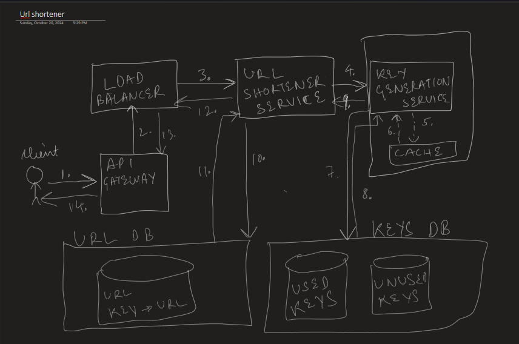

### Flow
1. Client makes a call to create a new shortened for their URL, it goes to API gateway
    - In API gateway, we can have rate limiter, request mapping and routing to hide the private subnet, which could only be accessible through this gateway
2. API gateway makes a call to Load balancer
    - Load balancer will be able to distribute our traffic to multiple instances of the service.
    - For simplicity, we can have round robin strategy.
3. The request goes to URL shortener service
    - This will be the main service that maps a key to the URL and returns response back to the LB
4. URL shortener service will need to generate a key, which needs to be mapped to the user's URL. For this the key generation service will be called.
    - The key generation service will keep on generating the keys on a regular period. It will store some of the keys in cache for faster response. If the number of keys present in the database drops below a threshold, it will generate new keys and store in the DB.
    - When generating the keys, we need to take care of collision. We will have a separate DB to store used and unused keys, this way we will not slow down the main service, which will have its own DB.
5. Key will be returned from the cache. If nothing in cache, it will load it from DB. Most of the time, there will be multiple keys in the cache, even on the service start. This will be a backup to get the key from DB.
6. URL shortener service uses that key and maps it to the URL. Then that mapping is stored in the DB.
7. The response is sent back through the opened connection, which contains the new shortened URL.
